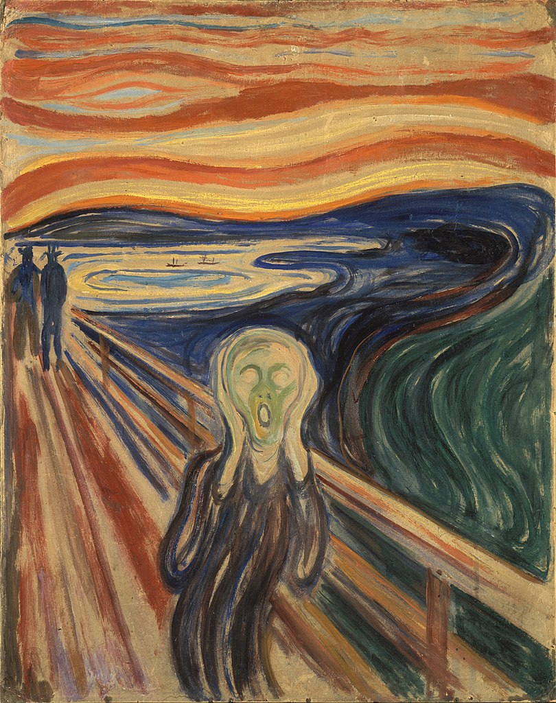
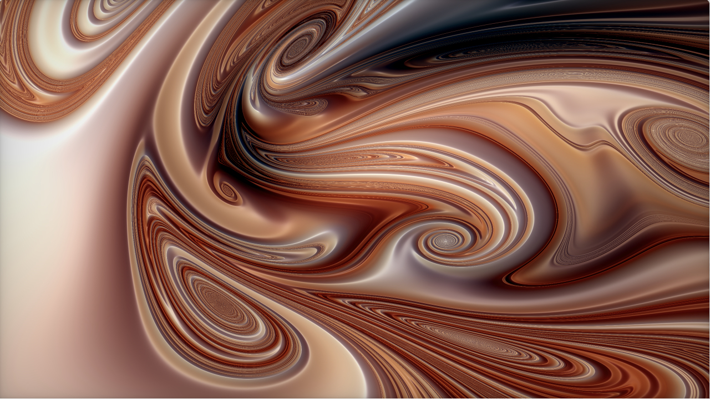
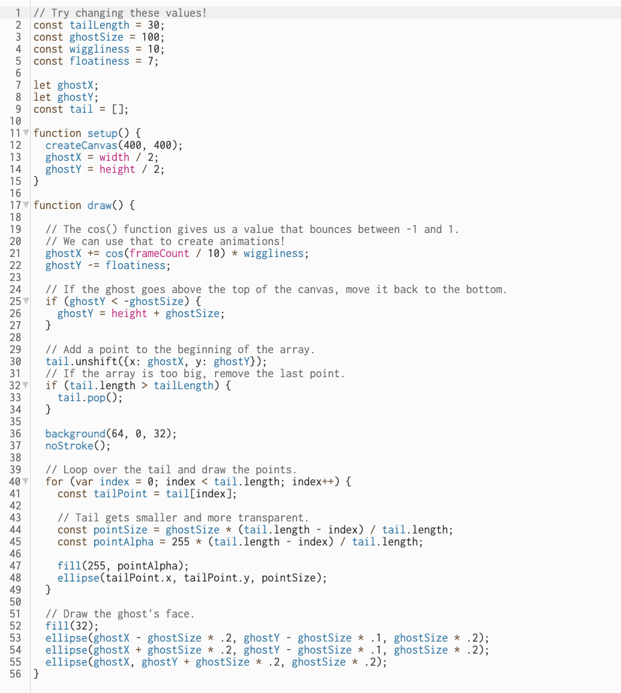

# hzen0883_9103_tut4

Week 8 Quiz

# Edvard Munch 'The Scream'

## Source of inspiration
- 1st 

[1st link](https://www.shadertoy.com/view/4t3SzN)
I think the background of 'The Scream'is similar to that of this picture, both of which have a sense of dynamic distortion, giveing people a chaotic and distorted visual experience.And the colors also have a certain degree of fit. It's a mixture of warm colors. So I think this image can be used as a source of inspiration.

- 2nd

[2nd link](https://happycoding.io/tutorials/p5js/animation/ghost)
 The theme part of this case is a ghost moving across the screen with empty eye sockets and mouth that bear a resemblance to 'The Scream' chosen by our group. And this moving state on the screen can also provide a possibility to achieve dynamic effects - perhaps the subject of our group of selected images can also be considered to achieve a moving effect. 

## Coding example

[Coding link](https://happycoding.io/tutorials/p5js/animation/ghost)

This code simulates dynamic trailing effects, applicable to mimic the distorted environment in "The Scream." By adjusting parameters like `wiggliness` and `floatiness`, it can replicate the emotional impact and dynamic fluidity of the original artwork. Additionally, modifying `ghostSize` and transparency gradients enhances the character's dynamic presence. This technique not only emulates character dynamics but also explores innovative artistic expressions through programming, enriching digital artwork with visual interactivity and dynamic aesthetics.